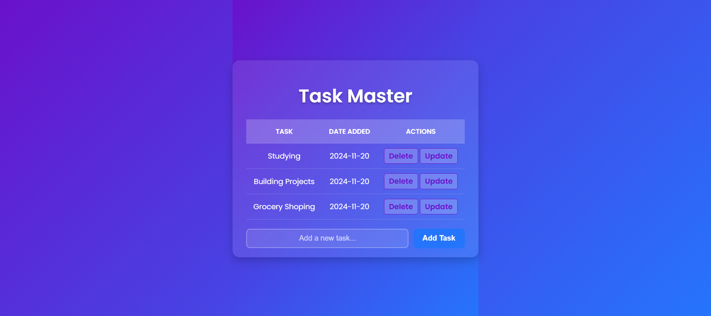
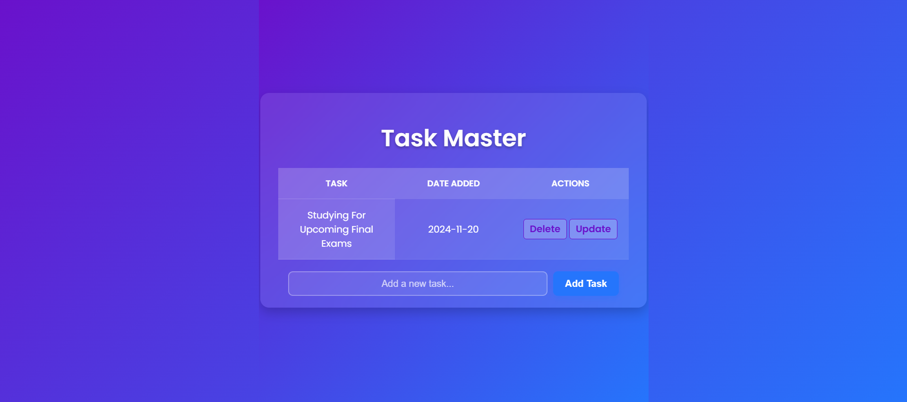

# Task Master 📝

**Task Master** is a beautifully designed, lightweight, and interactive task management web application built with Flask and SQLAlchemy. It allows users to create, update, and delete tasks effortlessly. The project showcases modern web design practices with a frosted glass UI, gradient backgrounds, and hover effects.

---

## Features
- **Add, Update, Delete Tasks**: Manage your daily tasks in a simple, user-friendly interface.
- **Modern UI**: Stylish frosted-glass design with gradient background and responsive layout.
- **Persistent Storage**: Uses SQLite to store tasks persistently.
- **Interactive Design**: Hover effects and smooth user interactions enhance the experience.
- **Lightweight and Fast**: Built with Python, Flask, and minimal CSS for efficient performance.

---

## Technologies Used
- **Backend**: Flask, Python, SQLAlchemy
- **Frontend**: HTML, CSS (with gradient effects and hover animations)
- **Database**: SQLite

---

## Screenshots
Here’s what the application looks like:

### 1. **Homepage with Tasks**
   

### 2. **Empty Task List**
   

### 3. **Update Task Form**
   

### 4. **Hover Effects For Long Tasks**
   

---

## How to Use
1. Clone this repository:
   ```bash
   git clone https://github.com/negarprh/task-master.git
   cd task-master
   ```
2. Install dependencies:
   ```bash
   pip install flask flask-sqlalchemy
   ```
3. Run the application:
   ```bash
   python app.py
   ```
4. Open your browser and navigate to:
   ```
   http://127.0.0.1:5000/
   ```

---

## Future Enhancements
- Add user authentication to manage tasks for individual users.
- Include due dates and task priorities.
- Integrate a search bar to filter tasks quickly.
- Add API support for mobile and third-party integrations.

---

## Credits
- UI inspiration from modern web design trends.
- Built with ❤️ by [Negar Pirasteh](https://github.com/prh).

---

## License
This project is licensed under the MIT License. See the [LICENSE](LICENSE) file for more information.
